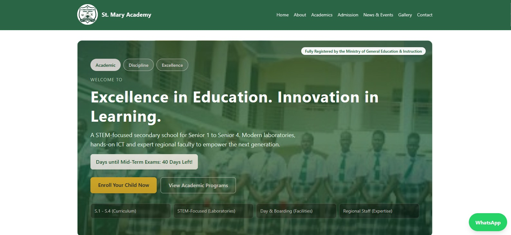
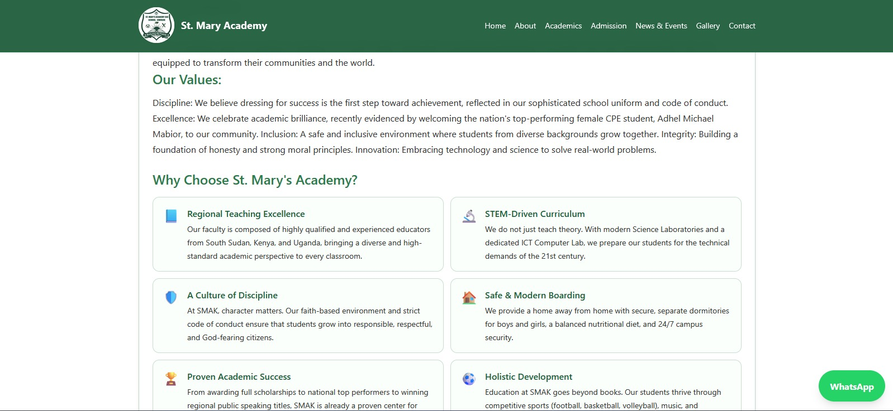
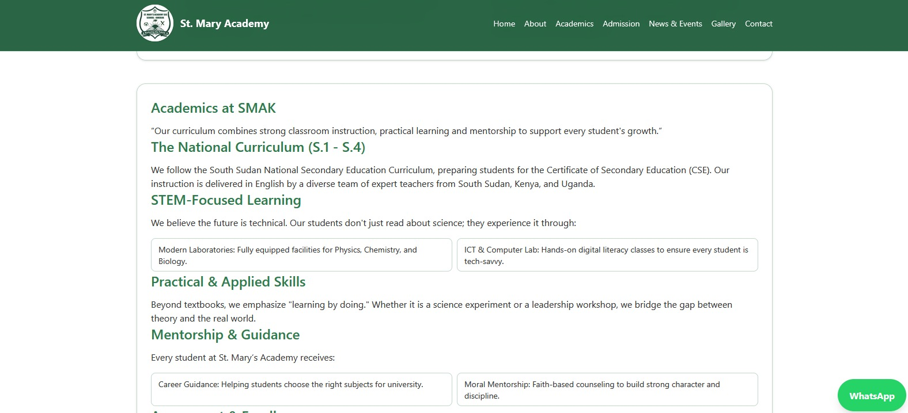
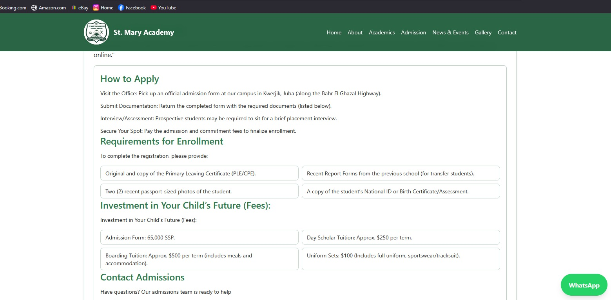
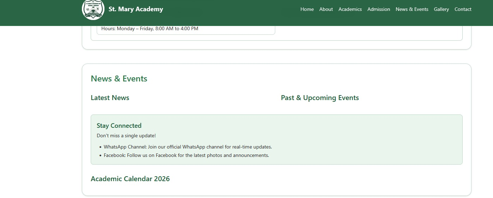
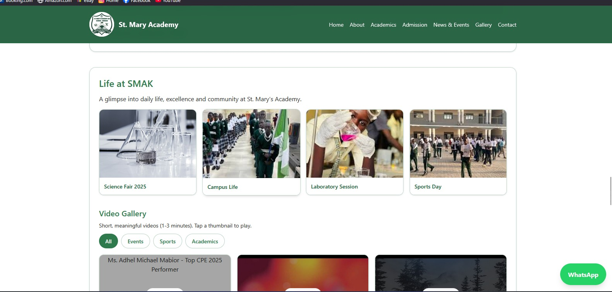
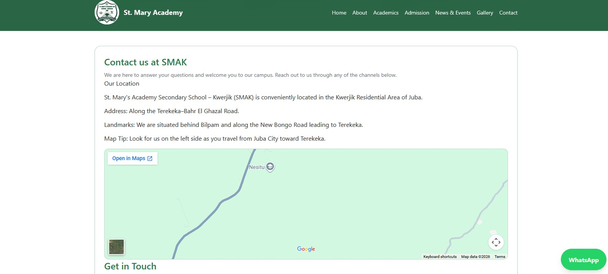
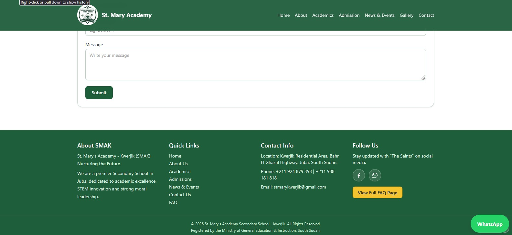

# 🏫 St Mary Academy Secondary School Website

A full-stack secondary school website built with **React.js**, **Django**, and **PostgreSQL**.

## 🚀 Tech Stack

- **Frontend:** React.js, Vite, CSS
- **Backend:** Django, Django REST Framework
- **Database:** PostgreSQL

## 📸 Screenshots

### 🏠 Home Page


### 📖 About


### 🎓 Academics


### 📋 Admission


### 📰 News & Events


### 🖼️ Gallery


### 📞 Contact


### Footer


## ⚙️ Installation & Setup

### Backend
```bash
cd school-backend
python -m venv venv
source venv/Scripts/activate
pip install -r requirements.txt
python manage.py migrate
python manage.py runserver
```

### Frontend
```bash
cd school-website
npm install
npm start
```

## 🌐 Features

- Home page
- About page
- Academics
- Admissions
- Gallery
- News & Events
- Contact & FAQ

## 👨‍💻 Developer

**Majak Sabahker Chol**  
📧 majaksabahker249@gmail.com
